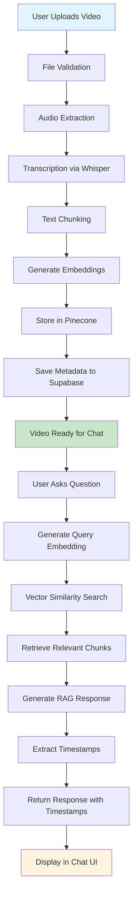

# 🎓 LectureChat - AI-Powered Video Learning Assistant

LectureChat is an intelligent video learning platform that allows users to upload educational videos and interact with them through an AI-powered chat interface. The system uses advanced RAG (Retrieval-Augmented Generation) technology to provide contextual answers with precise timestamp references.

## 🌟 Features

- **📹 Video Upload & Processing**: Support for multiple video/audio formats (MP4, AVI, MOV, MP3, WAV, etc.)
- **🎯 AI-Powered Transcription**: Automatic transcription using OpenAI Whisper API
- **🧠 Intelligent Text Chunking**: Semantic text segmentation with overlap for better context
- **🔍 Vector Search**: Advanced similarity search using Pinecone vector database
- **💬 Interactive Chat**: RAG-powered chat interface with timestamp navigation
- **⏰ Timestamp Navigation**: Click on timestamps to jump to specific video moments
- **📊 Real-time Processing**: Live status updates during video processing
- **💾 Persistent Storage**: Chat history and video metadata stored in Supabase

## 🏗️ Architecture Overview

```
┌─────────────────┐    ┌─────────────────┐    ┌─────────────────┐
│   Frontend      │    │   Backend       │    │   External      │
│   (React)       │    │   (Express)     │    │   Services      │
├─────────────────┤    ├─────────────────┤    ├─────────────────┤
│ • Upload UI     │◄──►│ • File Upload   │◄──►│ • OpenAI API    │
│ • Chat Interface│    │ • Transcription │    │ • Pinecone DB   │
│ • Video Player  │    │ • Text Chunking │    │ • Supabase DB   │
│ • Dashboard     │    │ • Embeddings    │    │ • FFmpeg        │
│ • Routing       │    │ • Vector Search │    │                 │
└─────────────────┘    └─────────────────┘    └─────────────────┘
```

## 🔄 Processing Flow Diagram



## 🚀 Quick Start

### Prerequisites

- Node.js (v16 or higher)
- npm or yarn
- OpenAI API key
- Pinecone account and API key
- Supabase project

### Installation

1. **Clone the repository**
   ```bash
   git clone <repository-url>
   cd lecturechat
   ```

2. **Install frontend dependencies**
   ```bash
   npm install
   ```

3. **Install backend dependencies**
   ```bash
   cd server
   npm install
   cd ..
   ```

4. **Environment Setup**
   
   Create a single `.env` file in the root directory:
   ```bash
   cp .env.example .env
   ```
   
   **Root (.env)**
   ```bash
   # Server Configuration
   PORT=3001
   NODE_ENV=development
   
   # OpenAI Configuration
   OPENAI_API_KEY=your_openai_api_key
   
   # Pinecone Configuration
   PINECONE_API_KEY=your_pinecone_api_key
   PINECONE_ENVIRONMENT=your_pinecone_environment
   PINECONE_INDEX_NAME=videochunks
   
   # Supabase Configuration
   SUPABASE_URL=your_supabase_url
   SUPABASE_ANON_KEY=your_supabase_anon_key
   
   # File Upload Configuration
   MAX_FILE_SIZE=2147483648
   UPLOAD_DIR=uploads
   TEMP_DIR=temp
   
   # Processing Configuration
   CHUNK_SIZE=1000
   CHUNK_OVERLAP=200
   BATCH_SIZE=100
   MAX_RETRIES=3
   ```
   
   **Note**: The server automatically loads environment variables from the root `.env` file. No separate server `.env` file is needed.

5. **Database Setup**
   - Run the migration files in your Supabase project:
     - `supabase/migrations/20250106000000_add_rag_tables.sql`
     - `supabase/migrations/20250115000000_add_missing_video_fields.sql`
     - `supabase/migrations/20250116000000_update_chat_conversations_schema.sql`

6. **Start the application**
   
   **Terminal 1 (Backend)**
   ```bash
   cd server
   npm run dev
   ```
   
   **Terminal 2 (Frontend)**
   ```bash
   npm run dev
   ```

7. **Access the application**
   - Frontend: http://localhost:5173
   - Backend API: http://localhost:3001

## 📁 Project Structure

```
lecturechat/
├── src/                          # Frontend React application
│   ├── components/ui/            # Reusable UI components
│   ├── pages/                    # Page components
│   │   ├── Index.tsx            # Landing page
│   │   ├── Upload.tsx           # Video upload interface
│   │   ├── Dashboard.tsx        # Video management
│   │   └── Chat.tsx             # Chat interface
│   ├── integrations/supabase/   # Supabase client setup
│   └── lib/                     # Utility functions
├── server/                       # Backend Express server
│   ├── routes/                  # API route handlers
│   │   ├── upload.js           # File upload & processing
│   │   ├── chat.js             # Chat & RAG functionality
│   │   └── processing.js       # Processing status & management
│   ├── services/               # Core business logic
│   │   ├── transcription.js    # Audio transcription
│   │   ├── textChunker.js      # Text segmentation
│   │   ├── embeddingService.js # Vector embeddings
│   │   ├── pineconeService.js  # Vector database operations
│   │   └── processingService.js # File processing pipeline
│   └── uploads/                # Temporary file storage
├── supabase/                    # Database migrations
└── public/                      # Static assets
```

## 🔧 API Endpoints

### Upload API (`/api/upload`)
- `POST /` - Upload and process video/audio files
- `GET /status/:videoId` - Get processing status
- `DELETE /:videoId` - Delete video and associated data
- `GET /stats` - Get processing statistics
- `GET /test-services` - Test service connections

### Chat API (`/api/chat`)
- `POST /` - Send chat message and get RAG response
- `GET /history/:videoId` - Get chat history
- `DELETE /conversation/:conversationId` - Delete conversation

### Processing API (`/api/processing`)
- `GET /status/:videoId` - Get detailed processing status
- `GET /transcript/:videoId` - Get full transcript
- `GET /chunks/:videoId` - Get text chunks (paginated)
- `POST /reprocess/:videoId` - Reprocess video
- `GET /health` - Health check

## 🛠️ Technology Stack

### Frontend
- **React 18** - Modern React with hooks
- **TypeScript** - Type-safe development
- **Vite** - Fast build tool and dev server
- **Tailwind CSS** - Utility-first CSS framework
- **Shadcn/ui** - Beautiful and accessible UI components
- **React Router** - Client-side routing
- **React Query** - Server state management
- **Supabase** - Backend as a Service

### Backend
- **Node.js** - JavaScript runtime
- **Express.js** - Web application framework
- **OpenAI API** - Whisper for transcription, GPT for chat
- **Pinecone** - Vector database for embeddings
- **Supabase** - PostgreSQL database
- **FFmpeg** - Audio/video processing
- **Multer** - File upload handling

## 🔍 How It Works

### 1. Video Processing Pipeline
1. **Upload**: User uploads video/audio file
2. **Validation**: File type and size validation
3. **Audio Extraction**: Extract audio track using FFmpeg
4. **Transcription**: Convert audio to text using OpenAI Whisper
5. **Chunking**: Split transcript into semantic chunks with overlap
6. **Embedding**: Generate vector embeddings for each chunk
7. **Storage**: Store embeddings in Pinecone, metadata in Supabase

### 2. Chat Interaction
1. **Query**: User asks a question about the video
2. **Embedding**: Generate embedding for the user's question
3. **Search**: Find similar chunks using vector similarity search
4. **Context**: Retrieve relevant text chunks with timestamps
5. **Generation**: Generate response using RAG with OpenAI GPT
6. **Timestamps**: Extract and validate timestamp references
7. **Response**: Return answer with clickable timestamps

### 3. Timestamp Navigation
- AI responses include timestamp references in `[MM:SS]` format
- Timestamps are extracted and validated against video duration
- Users can click timestamps to jump to specific video moments
- Fallback timestamps from relevant context chunks when needed

## 🚀 Deployment

### Frontend Deployment
1. Build the application: `npm run build`
2. Deploy the `dist` folder to your hosting service
3. Configure environment variables for production

### Backend Deployment
1. Set up a Node.js hosting service
2. Configure environment variables
3. Ensure FFmpeg is available on the server
4. Set up file storage for uploads

## 🤝 Contributing

1. Fork the repository
2. Create a feature branch: `git checkout -b feature-name`
3. Make your changes and commit: `git commit -m 'Add feature'`
4. Push to the branch: `git push origin feature-name`
5. Submit a pull request

## 📄 License

This project is licensed under the MIT License - see the LICENSE file for details.

## 🆘 Support

For support and questions:
- Check the troubleshooting section in `server/README.md`
- Review the API documentation
- Check server logs for detailed error information

## 🔮 Future Enhancements

- Multi-language transcription support
- Video chapter detection
- Collaborative note-taking
- Advanced search filters
- Mobile application
- Integration with learning management systems

---

**Built with ❤️ for better learning experiences**
